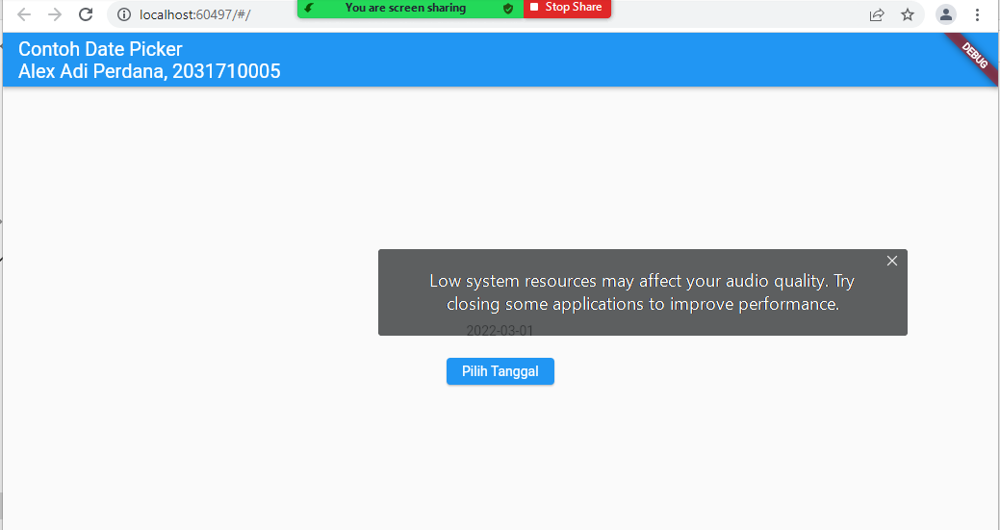
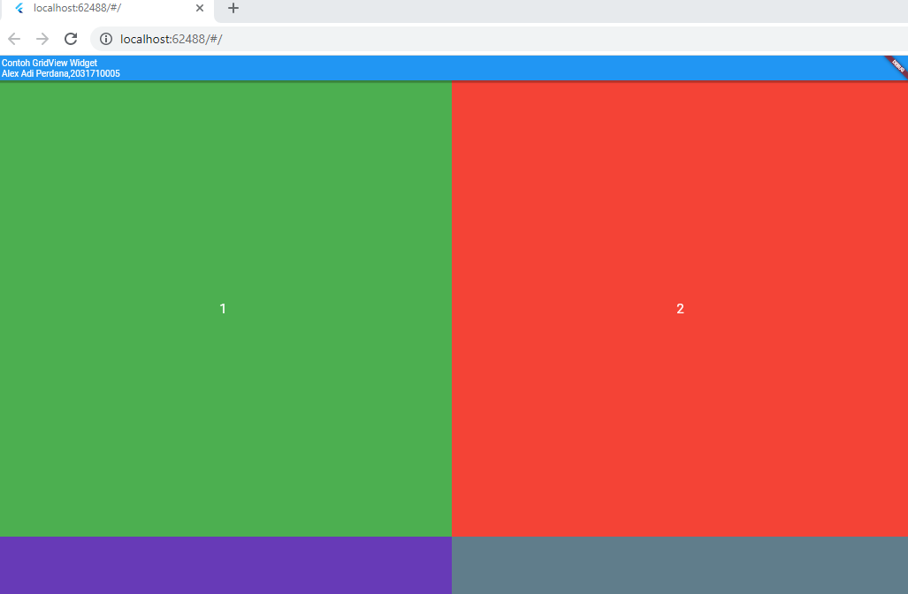
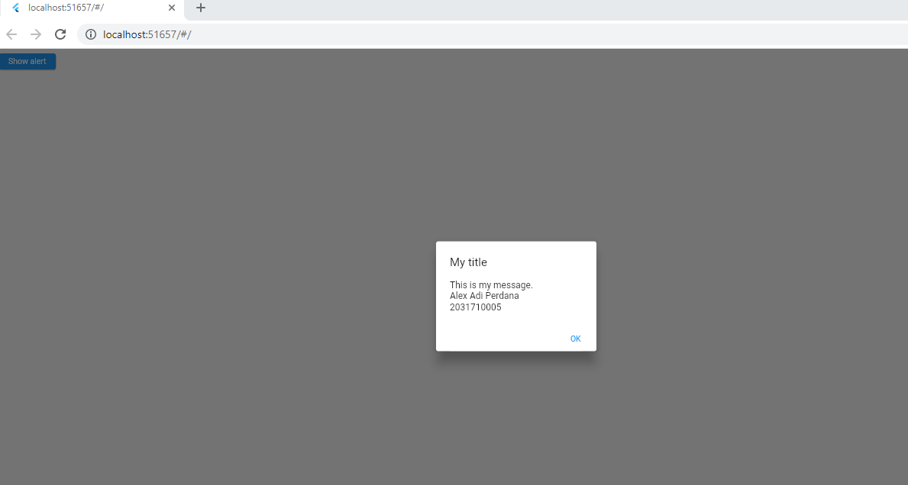
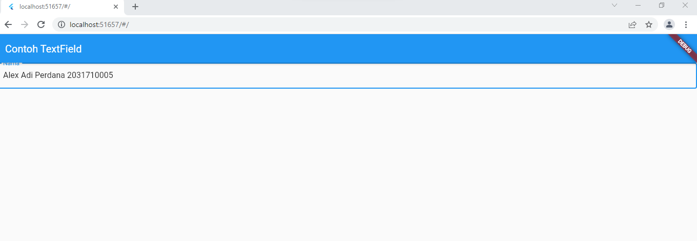
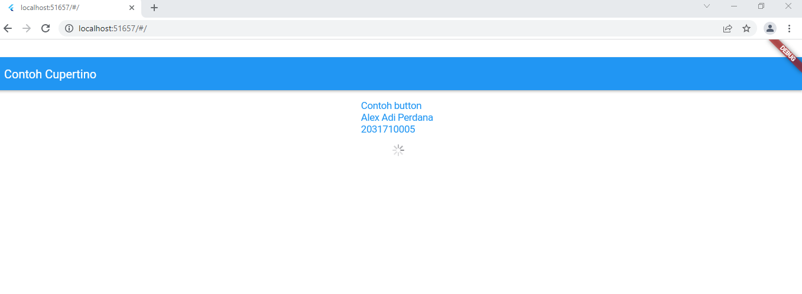
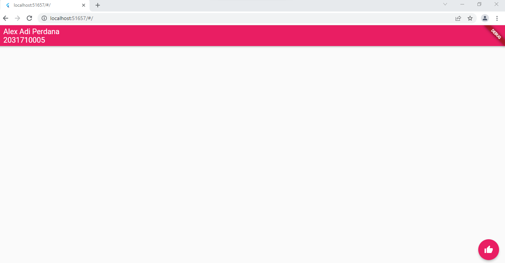
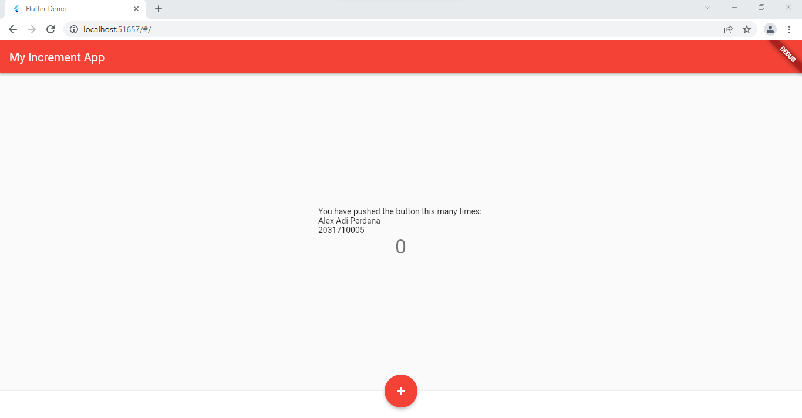
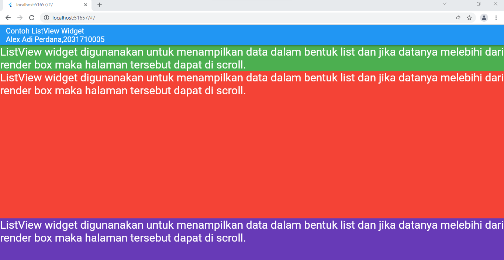
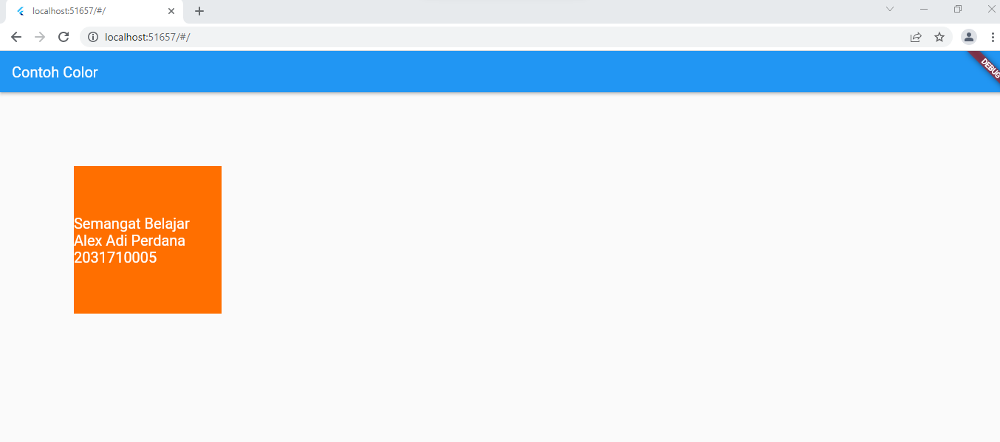
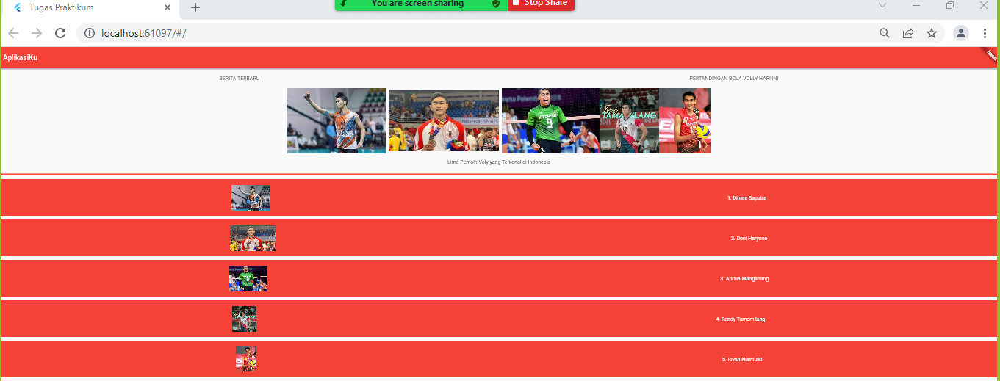

# jobsheet_2

A new Flutter project.

## Hasil Screnshoot date.dart

# Hasil Screnshoot grid

# Hasil Screnshoot dialog

# Hasil Screnshoot input

# Hasil Screnshoot material_design

# Hasil Screnshoot button

# Hasil Screnshoot Scaffolt

# Hasil Screnshoot list

# Hasil Screnshoot column

# Hasil Screnshoot property_color

# Hasil Screnshoot Tugas

